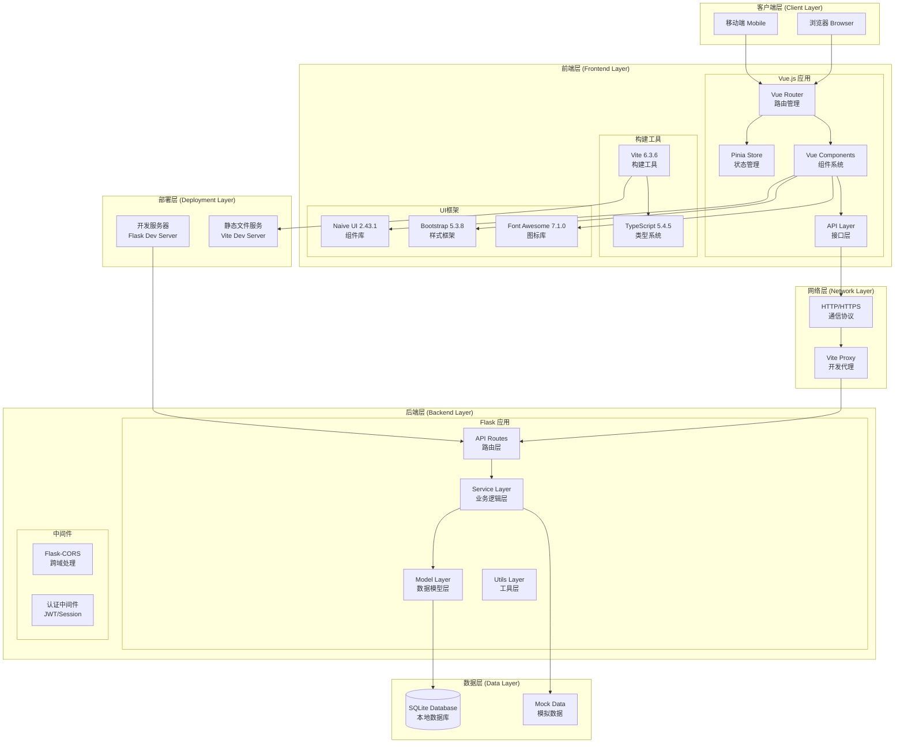
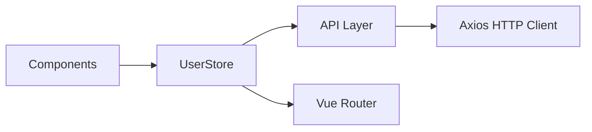
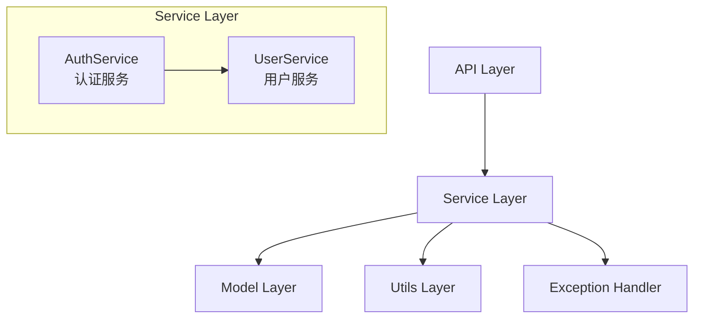
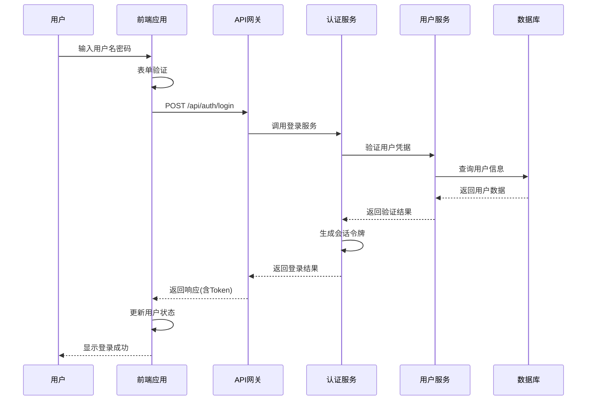
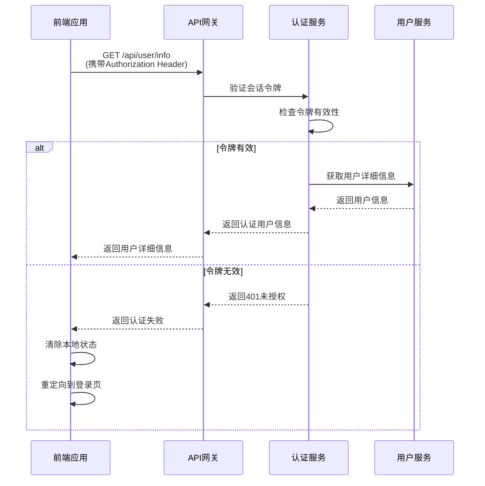
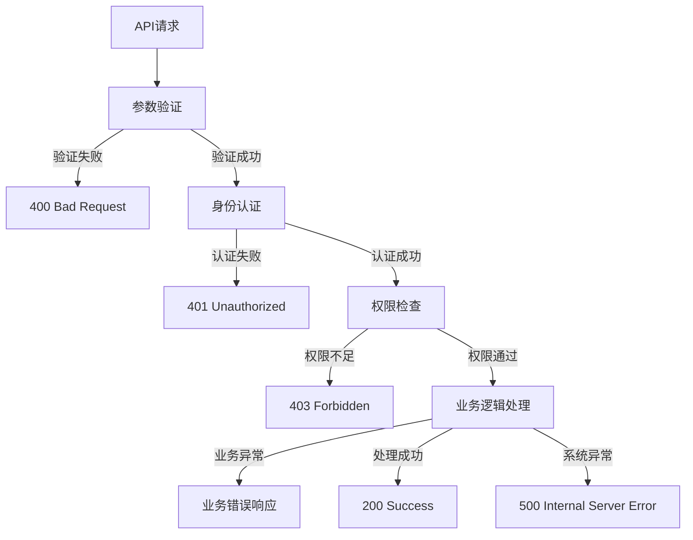
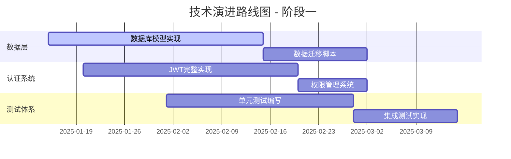
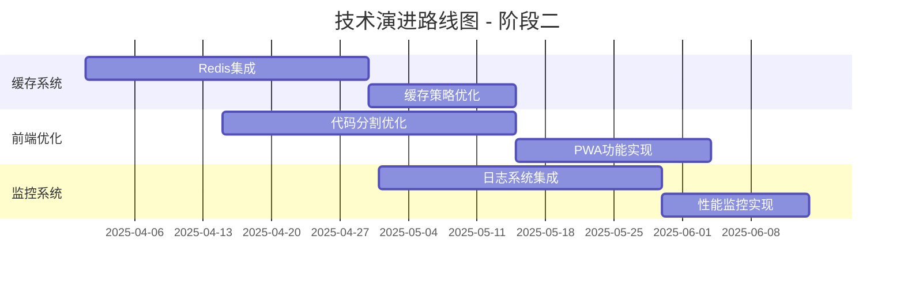
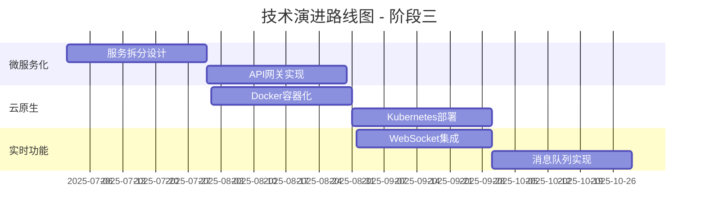

# JuFireX 技术架构文档

## 文档信息
- **项目名称**: JuFireX (爝火工作室项目)
- **版本**: v0.0.1
- **文档版本**: v1.0
- **创建日期**: 2025-01-15
- **最后更新**: 2025-01-15

---

## 1. 项目整体架构分析

### 1.1 架构拓扑图



### 1.2 技术栈组成

#### 前端技术栈 (Frontend Stack)
| 技术组件 | 版本 | 选型依据 | 功能职责 |
|---------|------|----------|----------|
| **Vue.js** | 3.4.27 | 现代化响应式框架，组合式API | 前端核心框架 |
| **TypeScript** | 5.4.5 | 类型安全，开发体验优化 | 类型系统 |
| **Vite** | 6.3.6 | 快速构建，HMR支持 | 构建工具 |
| **Vue Router** | 4.3.2 | 官方路由解决方案 | 路由管理 |
| **Pinia** | 2.1.7 | 现代状态管理，TypeScript友好 | 状态管理 |
| **Naive UI** | 2.43.1 | 现代化组件库，TypeScript支持 | UI组件库 |
| **Bootstrap** | 5.3.8 | 成熟的CSS框架，响应式布局 | 样式框架 |
| **Axios** | 1.7.2 | HTTP客户端，拦截器支持 | 网络请求 |
| **Font Awesome** | 7.1.0 | 丰富的图标库 | 图标系统 |

#### 后端技术栈 (Backend Stack)
| 技术组件 | 版本 | 选型依据 | 功能职责 |
|---------|------|----------|----------|
| **Flask** | ≥3.0 | 轻量级Web框架，灵活性高 | Web框架 |
| **Flask-SQLAlchemy** | ≥3.1 | ORM支持，数据库抽象 | 数据库ORM |
| **Flask-CORS** | - | 跨域资源共享支持 | 跨域处理 |
| **Flask-JWT-Extended** | ≥4.6 | JWT认证支持 | 身份认证 |
| **Werkzeug** | ≥3.0 | WSGI工具库 | Web服务器网关 |
| **SQLite** | - | 轻量级数据库，开发友好 | 数据存储 |
| **Python-dotenv** | ≥1.0 | 环境变量管理 | 配置管理 |
| **Gunicorn** | - | WSGI HTTP服务器 | 生产部署 |

---

## 2. 核心模块分析

### 2.1 前端模块结构

#### 2.1.1 路由模块 (Router Module)
**文件位置**: `frontend/src/router/index.ts`

**功能职责**:
- 定义应用路由规则
- 管理页面导航
- 支持懒加载组件

**接口定义**:
```typescript
interface RouteRecordRaw {
  path: string;
  name: string;
  component: () => Promise<Component>;
}
```

**典型代码示例**:
```typescript
const routes: RouteRecordRaw[] = [
  { path: "/", name: "home", component: () => import("@/views/Home.vue") },
  { path: "/login", name: "login", component: () => import("@/views/Login.vue") },
  { path: "/register", name: "register", component: () => import("@/views/Register.vue") }
];
```

#### 2.1.2 状态管理模块 (Store Module)
**文件位置**: `frontend/src/store/user.ts`

**功能职责**:
- 管理用户登录状态
- 缓存用户信息
- 提供状态操作方法

**接口定义**:
```typescript
interface UserInfo {
  id: number;
  username: string;
  nickname: string;
  email: string;
  avatar: string | null;
  permission: number;
}

interface UserSession {
  isLoggedIn: boolean;
  user: UserInfo | null;
}
```

**依赖关系**:


#### 2.1.3 API接口模块 (API Module)
**文件位置**: `frontend/src/api/`

**功能职责**:
- 封装后端API调用
- 统一错误处理
- 类型安全的接口定义

**典型代码示例**:
```typescript
// 用户登录接口
export async function login(credentials: {
  username: string;
  password: string;
}): Promise<ApiResponse<UserInfo>> {
  return await http.post("/auth/login", credentials);
}

// 获取用户信息接口
export async function getUserInfo(): Promise<ApiResponse<UserInfo>> {
  return await http.get("/user/info");
}
```

### 2.2 后端模块结构

#### 2.2.1 API路由层 (API Routes Layer)
**文件位置**: `backend/app/api/`

**功能职责**:
- 处理HTTP请求路由
- 参数验证和解析
- 响应格式化

**模块划分**:
- `auth.py`: 认证相关API (注册、登录、登出)
- `user.py`: 用户管理API (用户信息、权限管理)

**典型代码示例**:
```python
@bp.route("/login", methods=["POST"])
def login():
    """用户登录接口"""
    try:
        data = request.get_json()
        username = data.get('username', '').strip()
        password = data.get('password', '')
        
        login_result = auth_service.login_user(username, password)
        return success(login_result, "登录成功")
        
    except ApiException as e:
        return fail(e.code, e.message)
```

#### 2.2.2 服务层 (Service Layer)
**文件位置**: `backend/app/service/`

**功能职责**:
- 业务逻辑处理
- 数据验证
- 跨模块协调

**模块划分**:

- `auth_service.py`: 认证业务逻辑
- `user_service.py`: 用户管理业务逻辑

**依赖关系图**:



#### 2.2.3 数据模型层 (Model Layer)
**文件位置**: `backend/app/model/`

**功能职责**:
- 数据模型定义
- 数据库映射
- 数据验证规则

**典型代码示例**:
```python
class User(db.Model):
    """用户模型类"""
    __tablename__ = "users"
    
    id = db.Column(db.Integer, primary_key=True)
    username = db.Column(db.String(50), unique=True, nullable=False)
    nickname = db.Column(db.String(100), nullable=False)
    email = db.Column(db.String(255), unique=True, nullable=False)
    permission = db.Column(db.Integer, default=1, nullable=False)
```

---

## 3. 系统交互分析

### 3.1 用户认证流程时序图



### 3.2 用户信息获取流程



### 3.3 通信协议和数据格式

#### 3.3.1 HTTP通信协议
- **协议版本**: HTTP/1.1
- **请求方法**: GET, POST, PUT, DELETE
- **内容类型**: application/json
- **字符编码**: UTF-8

#### 3.3.2 API响应格式
```typescript
interface ApiResponse<T = any> {
  code: number;        // 状态码 (200: 成功, 4xx: 客户端错误, 5xx: 服务器错误)
  message: string;     // 响应消息
  data: T;            // 响应数据
}
```

#### 3.3.3 异常处理流程


---

## 4. 技术实现分析

### 4.1 架构风格分析

#### 4.1.1 整体架构风格
- **架构模式**: 前后端分离架构 (Frontend-Backend Separation)
- **通信方式**: RESTful API
- **数据流向**: 单向数据流 (Unidirectional Data Flow)

#### 4.1.2 后端架构模式
- **分层架构**: 三层架构 (Three-Tier Architecture)
  - 表现层 (Presentation Layer): API Routes
  - 业务逻辑层 (Business Logic Layer): Services
  - 数据访问层 (Data Access Layer): Models + ORM

#### 4.1.3 前端架构模式
- **组件化架构**: 基于Vue.js的组件化开发
- **状态管理模式**: Flux架构 (通过Pinia实现)
- **路由模式**: SPA单页应用模式

### 4.2 设计模式应用

#### 4.2.1 后端设计模式

**1. 蓝图模式 (Blueprint Pattern)**
```python
# 应用场景: API路由模块化
bp = Blueprint("auth", __name__, url_prefix="/api/auth")
app.register_blueprint(bp)
```

**2. 服务层模式 (Service Layer Pattern)**
```python
# 应用场景: 业务逻辑封装
class AuthService:
    def login_user(self, username: str, password: str) -> Dict[str, Any]:
        # 业务逻辑处理
        pass
```

**3. 工厂模式 (Factory Pattern)**
```python
# 应用场景: 响应对象创建
def success(data=None, message: str = "ok"):
    return jsonify({"code": 200, "message": message, "data": data})
```

#### 4.2.2 前端设计模式

**1. 组合式API模式 (Composition API Pattern)**
```typescript
// 应用场景: Vue 3组件逻辑复用
export const useUserStore = defineStore('user', () => {
  const userInfo = ref<UserInfo | null>(null)
  const isLoggedIn = ref<boolean>(false)
  
  return { userInfo, isLoggedIn }
})
```

**2. 代理模式 (Proxy Pattern)**
```typescript
// 应用场景: HTTP请求拦截
http.interceptors.response.use(
  (res) => res.data,
  (err) => Promise.reject(err)
)
```

### 4.3 第三方依赖分析

#### 4.3.1 前端依赖清单
```json
{
  "dependencies": {
    "@fortawesome/fontawesome-free": "^7.1.0",
    "axios": "^1.7.2",
    "bootstrap": "^5.3.8",
    "naive-ui": "^2.43.1",
    "pinia": "^2.1.7",
    "vue": "^3.4.27",
    "vue-router": "^4.3.2"
  },
  "devDependencies": {
    "@types/node": "^24.7.1",
    "@vitejs/plugin-vue": "^5.0.5",
    "typescript": "^5.4.5",
    "vite": "^6.3.6",
    "vitest": "^3.2.4"
  }
}
```

#### 4.3.2 后端依赖清单
```txt
flask>=3.0
flask_sqlalchemy>=3.1
flask_migrate>=4.0
flask_jwt_extended>=4.6
werkzeug>=3.0
python-dotenv>=1.0
pytest>=8.2
flask-socketio
flask_cors
Pillow
mistune
requests
gunicorn
pymysql
gevent
cryptography
```

---

## 5. 架构评估

### 5.1 优势分析

#### 5.1.1 可扩展性 (Scalability)
- **模块化设计**: 前后端分离，各模块职责清晰
- **组件化架构**: Vue组件可复用，易于扩展
- **服务层抽象**: 业务逻辑与数据访问分离
- **API设计**: RESTful风格，易于扩展新功能

#### 5.1.2 性能优势 (Performance)
- **前端优化**: Vite构建工具，HMR热更新
- **懒加载**: 路由级别的代码分割
- **缓存策略**: Pinia状态管理，减少重复请求
- **轻量级后端**: Flask框架，响应速度快

#### 5.1.3 开发体验 (Developer Experience)
- **类型安全**: TypeScript全栈类型支持
- **开发工具**: 完善的开发环境配置
- **代码规范**: 统一的代码风格和结构
- **调试友好**: 详细的错误处理和日志

### 5.2 当前局限性

#### 5.2.1 技术债务
1. **数据持久化**: 当前使用模拟数据，缺乏真实数据库集成
2. **认证机制**: 简化的会话管理，缺乏完整的JWT实现
3. **测试覆盖**: 测试用例不完整，缺乏自动化测试
4. **错误处理**: 前端错误处理机制需要完善

#### 5.2.2 性能瓶颈
1. **数据库查询**: 缺乏查询优化和索引策略
2. **缓存机制**: 没有实现Redis等缓存方案
3. **静态资源**: 缺乏CDN和资源优化策略
4. **并发处理**: 单线程Flask开发服务器限制

#### 5.2.3 安全性问题
1. **输入验证**: 需要加强前后端输入验证
2. **SQL注入**: 需要完善ORM使用规范
3. **XSS防护**: 需要实现内容安全策略
4. **HTTPS**: 生产环境需要SSL/TLS支持

### 5.3 改进方向

#### 5.3.1 短期改进 (1-3个月)
1. **数据库集成**: 完成SQLAlchemy数据库模型实现
2. **认证完善**: 实现完整的JWT认证机制
3. **测试补充**: 添加单元测试和集成测试
4. **错误处理**: 完善前端全局错误处理

#### 5.3.2 中期改进 (3-6个月)
1. **性能优化**: 实现Redis缓存和数据库优化
2. **安全加固**: 完善安全防护机制
3. **监控日志**: 添加应用监控和日志系统
4. **部署优化**: Docker容器化部署

#### 5.3.3 长期改进 (6-12个月)
1. **微服务架构**: 考虑服务拆分和微服务化
2. **云原生**: 迁移到云平台，实现弹性扩展
3. **实时通信**: 集成WebSocket实时功能
4. **移动端**: 开发移动端应用

---

## 6. 开发规划 (非生产环境)

### 6.1 技术演进路线图

#### 阶段一: 基础完善 (Q1 2025)


**关键里程碑**:
- [ ] 完成SQLAlchemy数据模型定义
- [ ] 实现JWT认证和刷新机制
- [ ] 建立完整的测试体系
- [ ] 完善API文档和接口规范

#### 阶段二: 性能优化 (Q2 2025)


**关键里程碑**:
- [ ] Redis缓存系统集成
- [ ] 前端性能优化完成
- [ ] 监控和日志系统建立
- [ ] 自动化部署流程

#### 阶段三: 架构升级 (Q3-Q4 2025)


### 6.2 潜在技术风险分析

#### 6.2.1 高风险项
| 风险项 | 风险等级 | 影响范围 | 缓解策略 |
|--------|----------|----------|----------|
| 数据库迁移 | 高 | 数据完整性 | 完善备份策略，分步迁移 |
| 认证系统重构 | 高 | 用户体验 | 向后兼容，灰度发布 |
| 微服务拆分 | 高 | 系统稳定性 | 充分测试，监控告警 |

#### 6.2.2 中风险项
| 风险项 | 风险等级 | 影响范围 | 缓解策略 |
|--------|----------|----------|----------|
| 性能优化 | 中 | 用户体验 | 性能基准测试，渐进优化 |
| 第三方依赖升级 | 中 | 功能稳定性 | 版本锁定，兼容性测试 |
| 团队技能提升 | 中 | 开发效率 | 技术培训，知识分享 |

### 6.3 实验性技术验证计划

#### 6.3.1 前端技术实验
1. **Vue 3.5+ 新特性验证**
   - Vapor Mode性能测试
   - 新的响应式API评估
   - 向后兼容性验证

2. **构建工具升级**
   - Vite 7.0 beta测试
   - Rollup 4.0集成验证
   - 构建性能对比分析

#### 6.3.2 后端技术实验
1. **异步框架评估**
   - FastAPI性能对比
   - Quart异步Flask替代方案
   - 并发处理能力测试

2. **数据库技术验证**
   - PostgreSQL迁移可行性
   - 数据库连接池优化
   - 读写分离架构验证

#### 6.3.3 DevOps技术实验
1. **容器化技术**
   - Docker多阶段构建优化
   - Kubernetes本地开发环境
   - 服务网格(Istio)可行性

2. **CI/CD流程**
   - GitHub Actions自动化
   - 自动化测试集成
   - 蓝绿部署策略验证

---

## 7. 技术参考链接

### 7.1 官方文档
- [Vue.js 3 官方文档](https://vuejs.org/)
- [TypeScript 官方文档](https://www.typescriptlang.org/)
- [Vite 官方文档](https://vitejs.dev/)
- [Naive UI 组件库](https://www.naiveui.com/)
- [Flask 官方文档](https://flask.palletsprojects.com/)
- [SQLAlchemy 文档](https://docs.sqlalchemy.org/)

### 7.2 最佳实践
- [Vue.js 最佳实践指南](https://vuejs.org/guide/best-practices/)
- [TypeScript 编码规范](https://typescript-eslint.io/rules/)
- [Flask 应用架构模式](https://flask.palletsprojects.com/en/2.3.x/patterns/)
- [RESTful API 设计指南](https://restfulapi.net/)

### 7.3 性能优化
- [Web 性能优化指南](https://web.dev/performance/)
- [Vue.js 性能优化](https://vuejs.org/guide/best-practices/performance.html)
- [Flask 性能调优](https://flask.palletsprojects.com/en/2.3.x/deploying/)

### 7.4 安全指南
- [OWASP Web 安全指南](https://owasp.org/www-project-web-security-testing-guide/)
- [Flask 安全最佳实践](https://flask.palletsprojects.com/en/2.3.x/security/)
- [前端安全防护](https://cheatsheetseries.owasp.org/cheatsheets/Cross_Site_Scripting_Prevention_Cheat_Sheet.html)

---

## 8. 附录

### 8.1 关键代码片段集合

#### 8.1.1 前端核心代码
```typescript
// 用户状态管理 (frontend/src/store/user.ts)
export const useUserStore = defineStore('user', () => {
  const userInfo = ref<UserInfo | null>(null)
  const isLoggedIn = ref<boolean>(false)
  const isLoading = ref<boolean>(false)

  async function initUserState() {
    isLoading.value = true
    try {
      const response = await checkAuthStatus()
      if (response.code === 200 && response.data) {
        isLoggedIn.value = response.data.isLoggedIn
        userInfo.value = response.data.user
      }
    } catch (error) {
      console.error('检查用户状态失败:', error)
      clearUserState()
    } finally {
      isLoading.value = false
    }
  }

  return { userInfo, isLoggedIn, isLoading, initUserState }
})
```

#### 8.1.2 后端核心代码
```python
# 认证服务 (backend/app/service/auth_service.py)
class AuthService:
    def login_user(self, username: str, password: str) -> Dict[str, Any]:
        """用户登录"""
        if not username or not password:
            raise ApiException(400, "用户名和密码不能为空")
        
        user = self.authenticate_user(username, password)
        if not user:
            raise ApiException(401, "用户名或密码错误")
        
        session_token = self._generate_session_token()
        session_info = {
            'token': session_token,
            'user_id': user['id'],
            'created_at': datetime.utcnow().isoformat(),
            'expires_at': (datetime.utcnow() + timedelta(days=7)).isoformat(),
            'is_active': True
        }
        
        self._mock_sessions[session_token] = session_info
        return {
            'token': session_token,
            'user': {
                'id': user['id'],
                'username': user['username'],
                'nickname': user['nickname'],
                'avatar': user['avatar'],
                'permission': user['permission']
            },
            'expires_at': session_info['expires_at']
        }
```

### 8.2 配置文件示例

#### 8.2.1 Vite配置
```typescript
// frontend/vite.config.ts
export default defineConfig({
  plugins: [vue()],
  resolve: {
    alias: {
      "@": path.resolve(__dirname, "src"),
    },
  },
  server: {
    port: 5173,
    proxy: {
      "/api": {
        target: "http://localhost:5000",
        changeOrigin: true,
      },
    },
  },
});
```

#### 8.2.2 Flask配置
```python
# backend/config.py
class BaseConfig:
    SQLALCHEMY_DATABASE_URI = os.getenv("DATABASE_URL", "sqlite:///app.db")
    SQLALCHEMY_TRACK_MODIFICATIONS = False
    JWT_SECRET_KEY = os.getenv("JWT_SECRET_KEY", "change-this-secret")
    DEBUG = False
    TESTING = False

class DevelopmentConfig(BaseConfig):
    DEBUG = True
```

---

**文档结束**

> 本文档基于JuFireX项目v0.0.1版本分析生成，随着项目发展，架构可能会有所调整。建议定期更新本文档以保持与实际架构的一致性。