# JuFireX 架构图表源文件

## 1. 整体架构拓扑图

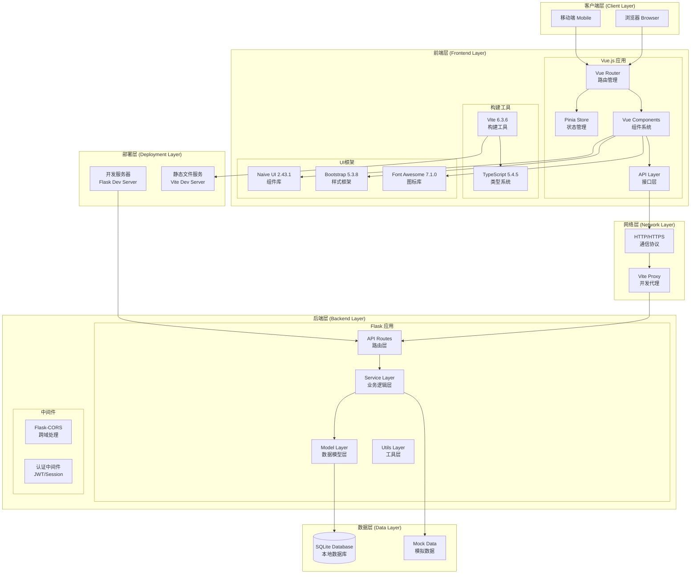

## 2. 服务层依赖关系图

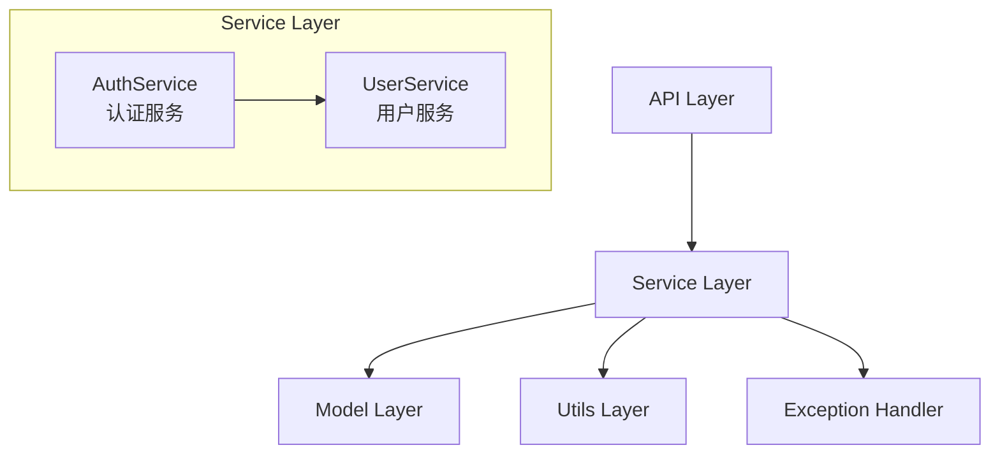

## 3. 前端状态管理依赖图

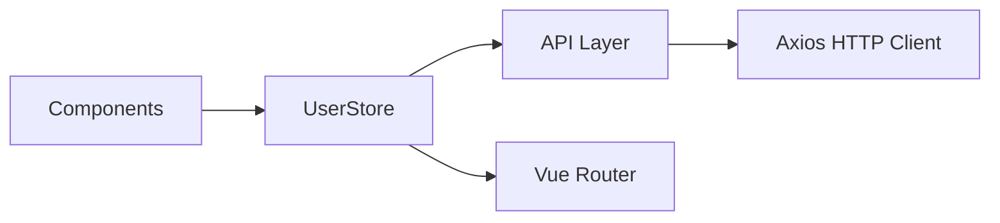

## 4. 用户认证流程时序图

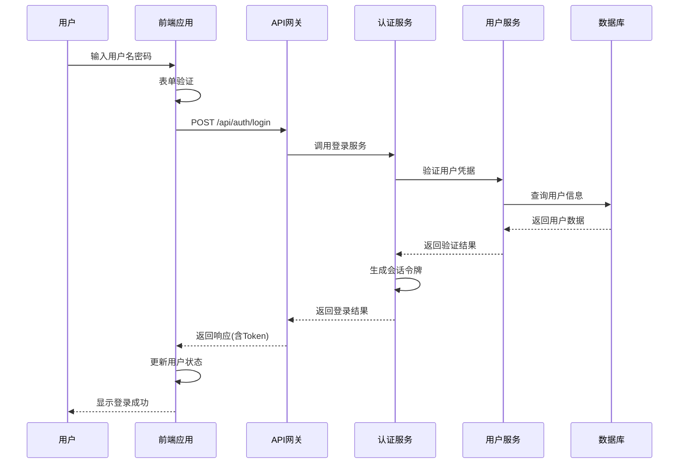

## 5. 用户信息获取流程时序图

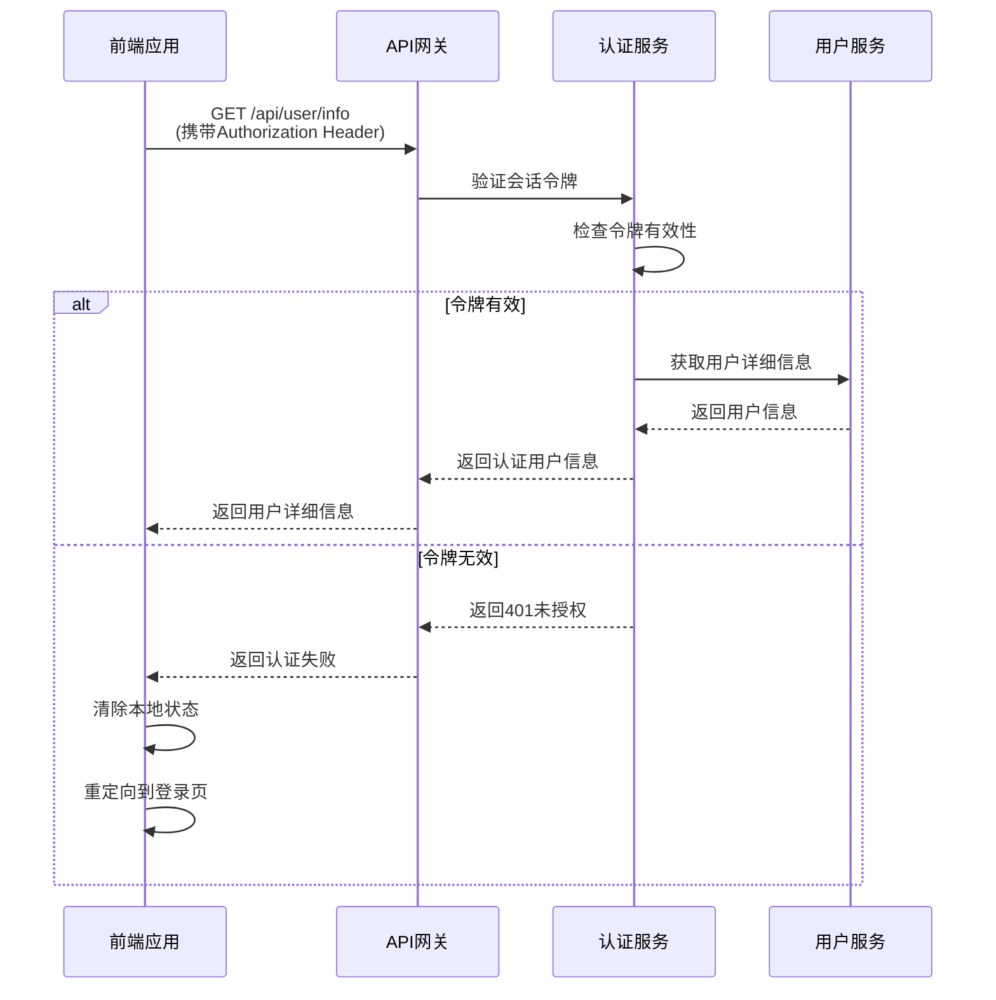

## 6. 异常处理流程图

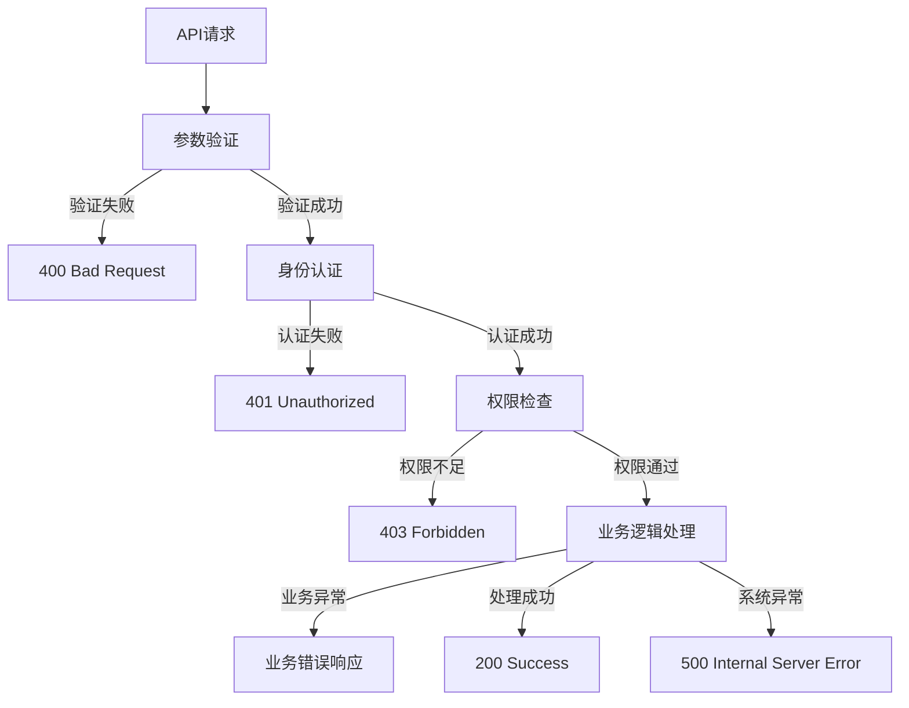

## 7. 技术演进路线图 - 阶段一

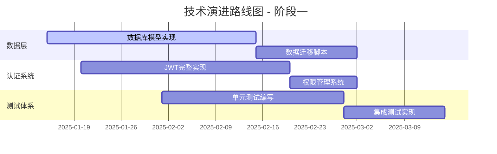

## 8. 技术演进路线图 - 阶段二

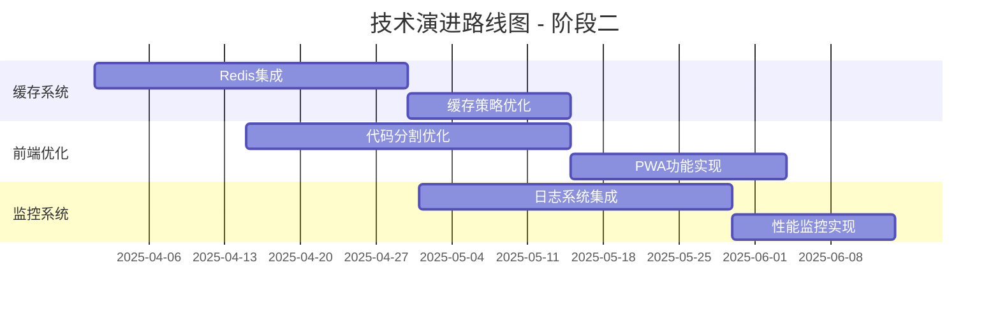

## 9. 技术演进路线图 - 阶段三

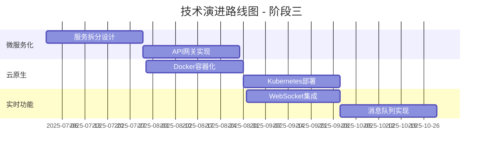

## 10. 数据模型关系图

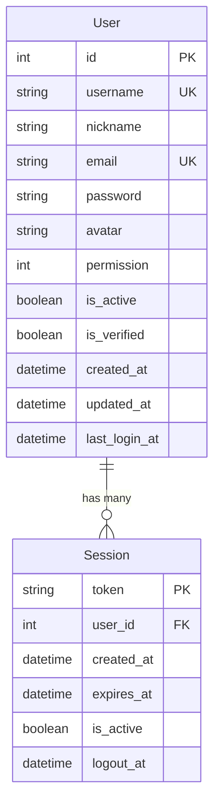

## 11. API路由结构图

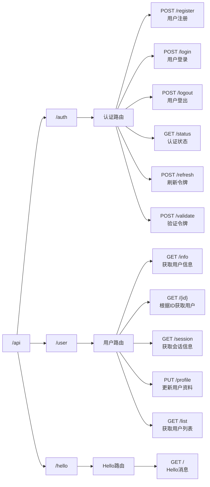

## 12. 前端组件层次结构图

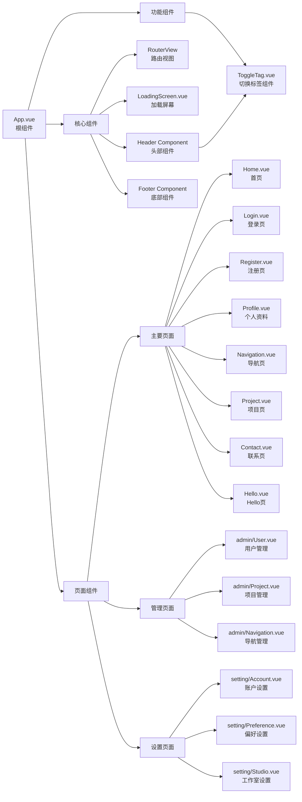